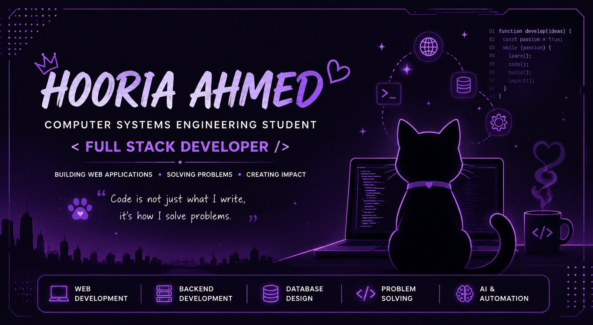

---

### 🐾 "Building websites, solving problems, and debugging with a cat as my coding partner." 💜

---

# 🌙 About Me

- 🎓 I am a **Computer Systems Engineering student at NED University**, graduating in 2028.
- 💻 Aspiring **Full Stack Developer** passionate about building scalable and user-focused web applications.
- 🌐 Currently developing my skills in **Frontend Development, Backend Development, and Database Management**.
- 🎨 Experienced in creating responsive interfaces using **HTML, CSS, and JavaScript**.
- ⚙️ Interested in building complete systems that combine **modern web technologies, automation, and intelligent solutions**.
- 🤖 Exploring **Artificial Intelligence and Machine Learning** alongside software development.
- 🐈 Fun fact: My debugging assistant is usually a cat who contributes absolutely no code but provides moral support.

---
# 💜 Languages & Technologies

 

 

 

---
# 🐱 GitHub Stats

 

---

### 💜 Thanks for visiting my profile!

